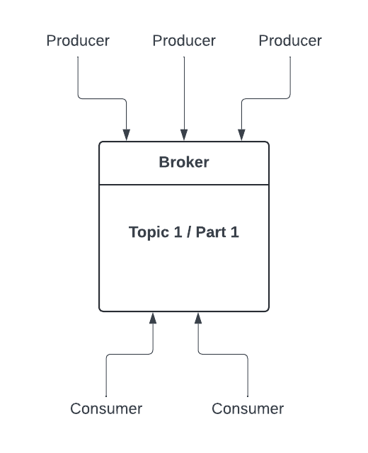
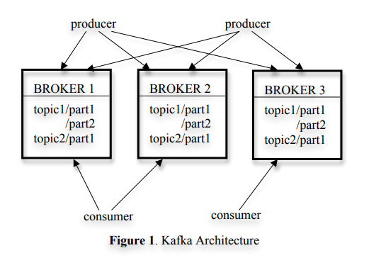

# ComLog

## About

### tl;dr

Commit log service in Golang similar to what Kafka is but without the distribution aspect.
Think of it like **1 broker with 1 topic and 1 partition** comparing it to the Kafka architecture.

|                                      ComLog                                      |               Kafka [source](https://notes.stephenholiday.com/Kafka.pdf)               |
| :------------------------------------------------------------------------------: | :------------------------------------------------------------------------------------: |
|  |  |

### The goal of the project

- Learn a lot about database concurrency, commit log, distributed systems...etc And most important one having fun 😁️

What is a commit log ? some resources to check out if you are curious:

- https://kafka.apache.org/documentation/#log
- https://cassandra.apache.org/doc/latest/cassandra/architecture/storage_engine.html#:~:text=Commitlogs%20are%20an%20append%20only,will%20be%20applied%20to%20memtables.
- https://engineering.linkedin.com/distributed-systems/log-what-every-software-engineer-should-know-about-real-time-datas-unifying
- https://dev.to/heroku/what-is-a-commit-log-and-why-should-you-care-pib

## Quick start

#### The commit log core library usage: [Core Library README](comLog/README.md)

- Start the server:

```shell
$ make default_server
```

#### The asynchronous producer API example:

```golang
package main

import (
	"context"
	"fmt"
	"sync"
	"time"

	"github.com/ayoyu/comLog/client"
	"go.uber.org/zap"
)

func main() {
	lg, err := zap.NewProduction()
	if err != nil {
		panic(err.Error())
	}
	defer lg.Sync()

	cli, err := client.New(
		context.TODO(),
		"localhost:50052",
		client.WithAsyncProducerLinger(1*time.Second),
		client.WithAsyncProducerBatchSize(40),
		client.WithLogger(lg),
		// If returnErrors set to fasle (by default), the errors will be logged instead
		// if any logger was defined.
		client.WithAsyncProducerReturnErrors(true),
	)
	if err != nil {
		panic(err.Error())
	}
	defer func() {
		if err := cli.Close(); err != nil {
			panic(err.Error())
		}
	}()

	asyncProducer := client.NewAsyncProducer(cli)
	defer func() {
		if err := asyncProducer.Close(); err != nil {
			panic(err.Error())
		}
	}()

	onCompletionCallback := func(resp *client.SendAppendResponse, wait *sync.WaitGroup) {
		fmt.Println("On completion callback fired with response: ", resp)
		wait.Done()
	}

	done := make(chan struct{})
	defer close(done)
	// The goroutine responsible for getting the errors during
	// the records production stream.
	go func() {
		for {
			select {
			case err := <-asyncProducer.Errors():
				fmt.Println("Async producer error during the records production stream: ", err)
			case <-done:
				fmt.Println("Done, Bye !")
				return
			}
		}
	}()

	records := [][]byte{
		[]byte("aaaaaaaaaa"),
		[]byte("bbbbbbbbbb"),
		[]byte("cccccccccc"),
		[]byte("dddddddddd"),

		[]byte("eeeeeeeeee"),
		[]byte("ffffffffff"),
		[]byte("gggggggggg"),
		[]byte("hhhhhhhhhh"),

		[]byte("iiiiiiiiii"),
		[]byte("jjjjjjjjjj"),
		[]byte("kkkkkkkkkk"),
		[]byte("llllllllll"),

		[]byte("mmmmmmmmmm"),
		[]byte("nnnnnnnnnn"),
		[]byte("oooooooooo"),
		[]byte("pppppppppp"),

		[]byte("qqqqqqqqqq"),
		[]byte("rrrrrrrrrr"),
	}
	fmt.Println("Start calling the Send asynchronous operation")
	for _, record := range records {
		err := asyncProducer.Send(context.TODO(), &client.Record{Data: record}, onCompletionCallback)

		if err != nil {
			panic(err.Error())
		}
	}
	fmt.Println("Done calling the Send asynchronous operation")

	// To See/check the case when the wait `linger` time get triggered with the
	// `client.WithAsyncProducerLinger(1*time.Second)` before closing both
	// the producer and the client.
	time.Sleep(2 * time.Second)

}
```

#### The synchronous producer API examples:

- Appending a batch of records:

```golang
package main

import (
	"context"
	"fmt"

	"github.com/ayoyu/comLog/client"
	"go.uber.org/zap"
)

func main() {
	lg, err := zap.NewProduction()
	if err != nil {
		panic(err.Error())
	}
	defer lg.Sync()

	cli, err := client.New(
		context.TODO(),
		"localhost:50052",
		client.WithLogger(lg),
	)
	if err != nil {
		panic(err.Error())
	}
	defer func() {
		if err := cli.Close(); err != nil {
			panic(err.Error())
		}
	}()

	syncProducer := client.NewSyncProducer(cli)

	submittedBatch := []*client.Record{
		{Data: []byte("a")},
		{Data: []byte("bb")},
		{Data: []byte("ccc")},
		{Data: []byte("dddd")},
	}

	batchResp, err := syncProducer.BatchAppend(
		context.Background(),
		&client.BatchRecord{
			Batch: submittedBatch,
		},
	)
	if err != nil {
		panic(err.Error())
	}

	// The `nbrOfStoredBytes` response includes both:
	// stored bytes for the submitted record + the stored bytes of the offset (8 bytes)
	for _, resp := range batchResp.Response {
		fmt.Printf("Appended record response: %s ;"+
			"Record index in submitted batch: %d => %s \n",
			resp.Resp, resp.Index, string(submittedBatch[resp.Index].Data))
	}
}
```

- Appending a single record:

```golang
package main

import (
	"context"
	"fmt"

	"github.com/ayoyu/comLog/client"
	"go.uber.org/zap"
)

func main() {
	lg, err := zap.NewProduction()
	if err != nil {
		panic(err.Error())
	}
	defer lg.Sync()

	cli, err := client.New(
		context.TODO(),
		"localhost:50052",
		client.WithLogger(lg),
	)
	if err != nil {
		panic(err.Error())
	}
	defer func() {
		if err := cli.Close(); err != nil {
			panic(err.Error())
		}
	}()

	syncProducer := client.NewSyncProducer(cli)

	resp, err := syncProducer.Append(context.Background(), &client.Record{Data: []byte("Hello World")})
	if err != nil {
		panic(err.Error())
	}

	fmt.Println(resp)
}
```

#### The consumer API examples:

- WIP: Consume a single recording at a time
- WIP: `Poll` API.
